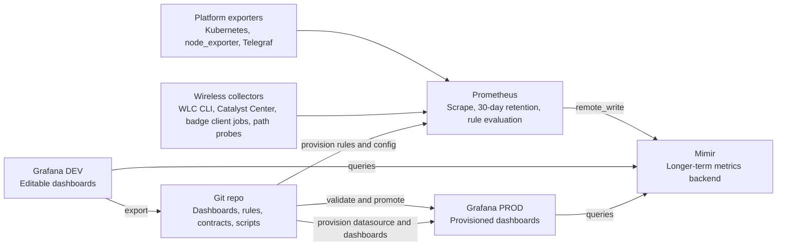
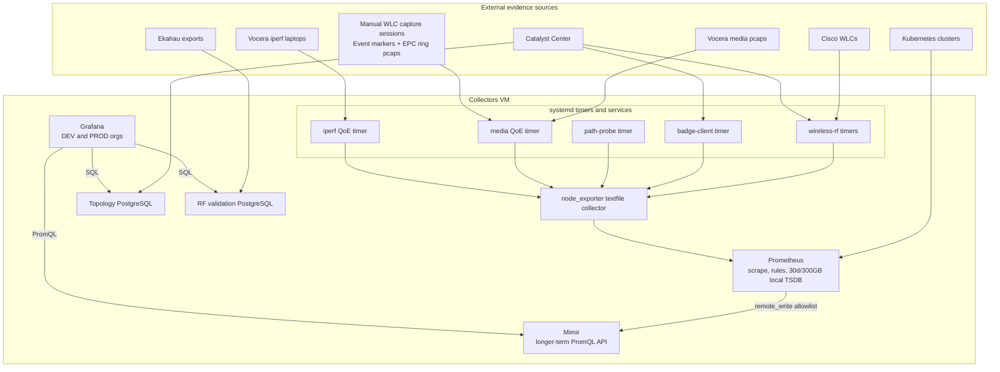
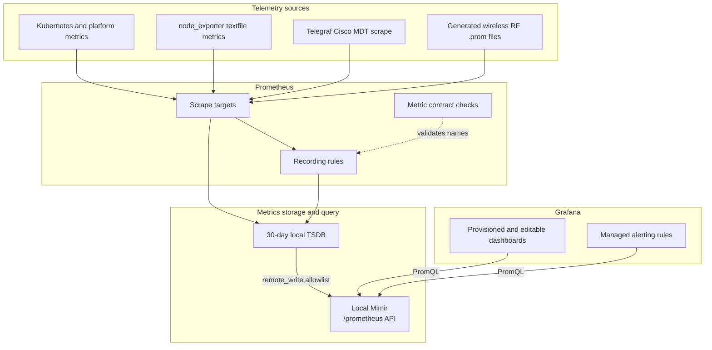
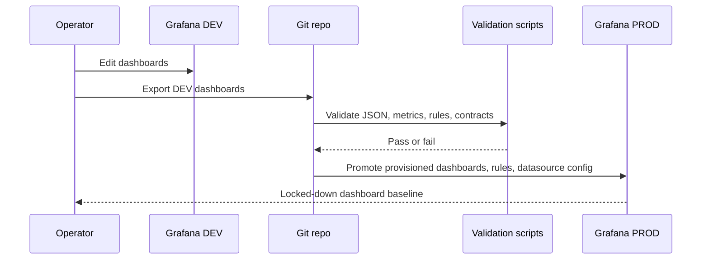
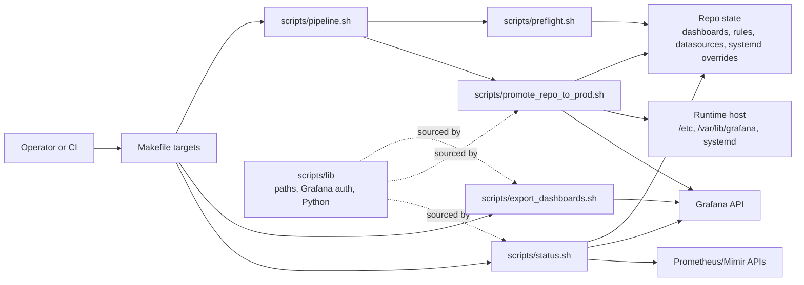
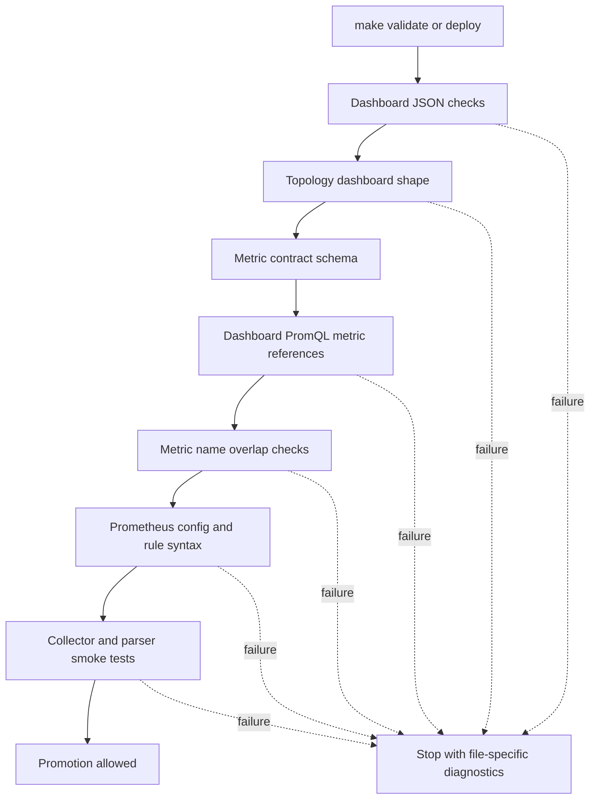
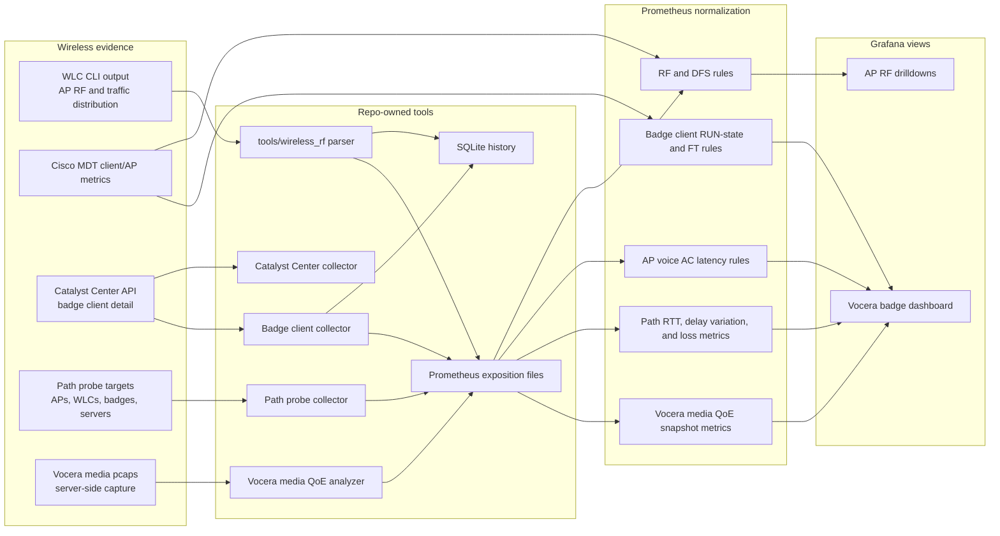
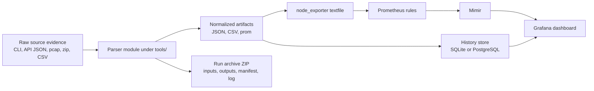
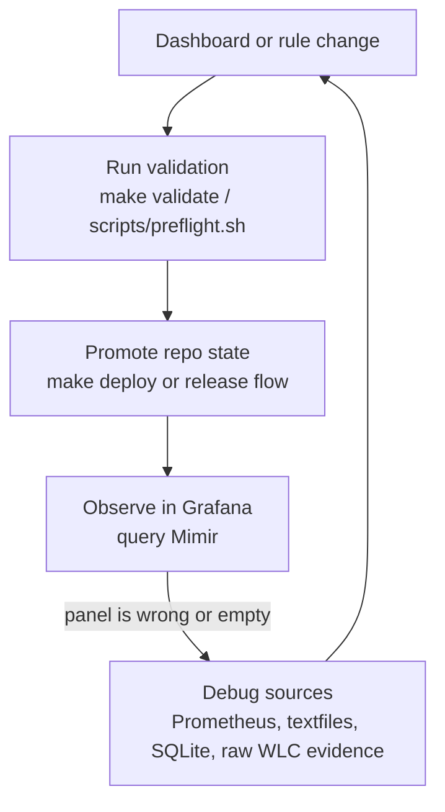

# Architecture Overview

This repo is the source of truth for Grafana dashboards, Prometheus rules,
metric contracts, deployment helpers, and the optional Cisco wireless RF
observability extension. Runtime systems collect and store telemetry; the repo
defines how that telemetry is normalized, validated, visualized, and promoted.

## System Context

## Runtime Deployment Topology

The single-VM profile keeps collection, rule evaluation, storage, and
visualization on the collectors host. Optional collectors publish normalized
textfiles or scrape targets; Prometheus records and remote-writes the curated
metric surface into Mimir; Grafana reads from Mimir and the topology/RF
PostgreSQL datasources.

## Runtime Metric Flow

Prometheus is the active scrape and rule-evaluation layer. Mimir is the query
backend that Grafana uses for dashboards. Local Prometheus retention is capped
at 30 days/300GB so it behaves like an evaluation buffer, not the durable
metrics store.

## Dashboard Promotion Flow

Production Grafana content is intentionally Git-backed and provisioned. DEV is
editable for iteration; PROD is converged from files after validation.

## Repository Control Plane

The repo is the control plane for promotion. `Makefile` exposes stable operator
commands; scripts hold the implementation; shared libraries keep path and
credential lookup consistent across export, validation, promotion, and status
operations.

## Validation Gate Detail

Validation is intentionally layered. Fast local checks catch malformed JSON and
metric-contract drift before promotion touches Grafana, Prometheus, or systemd.

## Wireless Extension Flow

The wireless extension is optional and source-specific. It does not change the
core Grafana/Mimir workflow; it adds WLC and badge telemetry as another metric
producer.

## Source-Specific Parser Pattern

Every optional parser follows the same shape: source-specific raw evidence is
normalized once, low-cardinality metrics go to Prometheus/Mimir, and detailed
investigation state goes to files or SQL tables.

This boundary keeps dashboard labels stable while preserving raw-enough detail
for debugging and rollback.

## Semantic Boundaries

| Area | Owned by | Important boundary |
| --- | --- | --- |
| Dashboard JSON | `grafana/dashboards-*` | DEV exports are editable snapshots; PROD is provisioned from Git. |
| Datasources and alerting | `grafana/provisioning/` | Stable datasource UIDs are referenced by dashboards and alerting rules. |
| Prometheus scrape and rules | `prometheus/` | Recording rules are the dashboard-facing metric surface. |
| Metric contract | `contracts/metric_contract.yaml` | Dashboard PromQL should reference only known raw, recorded, or allowed external metrics. |
| Platform deploy helpers | `scripts/`, `systemd/`, `mimir/` | Scripts converge the VM runtime from repo state. |
| Kubernetes scaffold | `deploy/k8s/` | Minimal Kustomize structure for dev/prod overlays. |
| Wireless parser and collectors | `tools/wireless_rf/` | Source-specific producers; they emit normalized files and metrics for Prometheus. |
| Path probe collector | `tools/path_probe/` | Measures synthetic RTT, delay variation, and loss; WLC-to-AP probes are round-trip, not one-way AP-to-WLC latency or RTP jitter. |
| Vocera media QoE analyzer | `tools/vocera_media_qoe/` | Offline pcap analyzer for server-side observed media quality; exact stream identity stays in JSON, not Prometheus labels. |
| Vocera WLC capture toolkit | `tools/vocera_media_qoe/vocera_wlc_*` | Manual WLC session-package generation, event markers, transcript parsing, artifact validation, attempt/session SQL, and conservative broadcast verdicts. |

## Wireless Latency Semantics

The dashboard intentionally keeps these concepts separate:

- AP voice access-category latency comes from WLC traffic-distribution CLI
  evidence and is recorded as `wireless_ap_voice_latency_*`.
- Client RUN-state latency comes from Cisco MDT client mobility history and is
  recorded as `wireless_badge_client_run_state_latency_*`.
- Legacy roam-duration compatibility metrics are sourced from the same
  RUN-state latency field and should not be presented as voice handoff
  interruption, RTP latency, or AP-to-client latency.
- Path probe latency is active RTT telemetry between infrastructure endpoints.
  It should not be mixed with AP voice access-category latency, client
  RUN-state latency, or badge media QoE.
- Badge-to-badge and badge-to-server latency/jitter require media-stream
  measurements, such as RTP/vRTP sequence, timestamp, and receiver-arrival
  analysis.

## Operational Responsibilities

## Where To Look Next

- `docs/cicd.md` explains dashboard export, validation, promotion, and DEV
  reseeding.
- `docs/local-mimir-vm.md` explains the local single-node Mimir profile.
- `docs/wireless-rf-observability.md` explains WLC RF parsing, badge metrics,
  and wireless dashboard semantics.
- `docs/repo-map.md` maps the main directories to their responsibilities.
