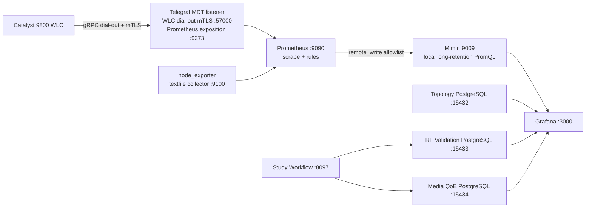

# Architecture overview

## Purpose and operating model

This repository controls a single collector-hosted observability platform and
its wireless evidence workflows. It intentionally separates a low-cardinality
metrics plane from a high-detail investigation plane:

- **Metrics plane:** WLC MDT, node-exporter textfiles, Prometheus recording
  rules, Mimir, Grafana, and the currently provisioned dashboards.
- **Investigation plane:** WLC CLI/EPC evidence, PCAP parser artifacts,
  badge/Ekahau correlation, Study metadata, session archives, and PostgreSQL.

Prometheus/Mimir provides stable operational metrics. Files and PostgreSQL
retain detailed evidence that must not become Prometheus labels.

## Deployed topology



### Listener, query, and datastore ports

| Component | Address/port | Role |
| --- | --- | --- |
| Telegraf MDT receiver | collector network address `:57000` | WLC-initiated gRPC/mTLS telemetry connection |
| Telegraf Prometheus endpoint | `127.0.0.1:9273` | Prometheus scrape target |
| node_exporter | `127.0.0.1:9100` | textfile metrics scrape target |
| Prometheus | `127.0.0.1:9090` | scrape, rule evaluation, local diagnostics |
| Mimir HTTP | `127.0.0.1:9009` | Prometheus remote_write and Grafana PromQL |
| Mimir gRPC | `127.0.0.1:9095` | internal single-node routing |
| Grafana | host `:3000` | UI and provisioned dashboards |
| Study Workflow | host `:8097` | RF/media investigation UI/API |
| Topology PostgreSQL | `127.0.0.1:15432` | local topology datasource |
| RF Validation PostgreSQL | `127.0.0.1:15433` | RF study datasource |
| Media QoE PostgreSQL | `127.0.0.1:15434` | media/session evidence datasource |

The network-visible MDT listener is distinct from Telegraf's local Prometheus
endpoint. A successful `curl :9273` proves metric exposition, not the WLC mTLS
transport.

## Data paths

### 1. Live WLC MDT

```text
WLC subscriptions 280/290
  -> WLC gRPC dial-out with mTLS
  -> Telegraf MDT receiver
  -> Telegraf :9273
  -> Prometheus raw metrics + recording rules
  -> Mimir remote_write allowlist
  -> WLC Control Plane Grafana dashboard
```

The repository consumes the telemetry. WLC receiver profiles, trustpoints,
certificates, source addresses, and subscriptions remain network-device
configuration managed through the network change process.

### 2. Scheduled low-cardinality textfiles

```text
RF parser / path probe / laptop iperf / generic PCAP publisher
  -> generated .prom file
  -> node_exporter textfile collector :9100
  -> Prometheus
  -> Mimir
```

These services publish bounded health/current-state metrics. Detailed events
and packet facts remain in files or PostgreSQL.

### 3. Manual WLC EPC capture session

```text
Study Web or CLI package generator
  -> session.json + password-free WLC command sheets
  -> operator runs WLC CLI interactively
  -> WLC outbound SCP export into session incoming/
  -> local one-minute ingest timer (when installed/enabled)
  -> stability check + magic bytes + SHA-256
  -> root-owned finalization into session pcaps/
  -> capture_point=wlc_epc registration + parser
  -> Media QoE PostgreSQL / Study Web artifact status
```

The session lane is isolated from generic media/ICAP discovery. Generic scans
must exclude `wlc-sessions` and `wlc-attempts`; Study Web rejects generic
registration of files inside those managed package roots.

The ingest service must not rename upload-owned files into final evidence.
Final EPCs are copied into service-created temp files, fsynced, owned by
`root:root`, chmodded non-writable to the SCP account, atomically renamed, and
hash-verified. The current production gate is documented in
[`wireless/vocera-wlc-phase0-production-contract.md`](wireless/vocera-wlc-phase0-production-contract.md).

### 4. Completed Catalyst Center ICAP PCAP

```text
read-only Catalyst Center API
  -> completed ICAP discovery/download
  -> generic media raw area
  -> batch parser
  -> Media QoE PostgreSQL + node-exporter health snapshot
```

This integration cannot start a capture, deploy settings, or execute device
commands. A WLC EPC is not an ICAP capture.

### 5. RF validation and topology

```text
badge/Ekahau input + manual samples -> RF Validation PostgreSQL -> Study Web
published Network-Topology CSV -> Topology PostgreSQL -> optional Grafana SQL datasource
```

Topology and RF datasources exist even when the corresponding dashboard is not
part of the tracked Grafana inventory.

## Runtime services and timers

| Unit or process | Purpose | Important boundary |
| --- | --- | --- |
| `mimir.service` | local single-node Mimir | local filesystem storage only |
| `vocera-rf-validation-study-web.service` | Study Workflow API/UI | no WLC SSH or secret persistence |
| `vocera-rf-validation-postgres.service` | RF investigation DB | local Podman PostgreSQL |
| `vocera-media-qoe-postgres.service` | media/session DB | local Podman PostgreSQL |
| `network-topology-postgres.service` | topology DB | local Podman PostgreSQL |
| `wireless-rf-textfile.timer` | RF textfile refresh | manual/source-specific evidence only |
| `wireless-path-probe.timer` | synthetic probe refresh | collector-originated measurement |
| `vocera-iperf-qoe-textfile.timer` | laptop JSON refresh | uploads are input evidence |
| `vocera-media-qoe-textfile.timer` | generic ICAP/imported-PCAP publisher | excludes WLC session/attempt trees |
| `vocera-media-qoe-wlc-session-ingest.timer` | WLC EPC session importer | enable only after Phase 0 rehearsal passes |

Some template units use a historical `/opt/...` checkout while newer units use
`/home/appsadmin/...`. Treat the **installed** unit and drop-in (`systemctl cat
<unit>`) as the runtime authority. Before reinstalling a service on a new host,
normalize its `WorkingDirectory`, `ExecStart`, and `ReadWritePaths` to the
actual checkout; do not infer it from a documentation example.

## Grafana and dashboard status

Grafana reads metrics from local Mimir. The datasource template sends an
`X-Scope-OrgID` header, but `mimir-local.yaml` has multitenancy disabled; the
header does not create a tenant boundary in this profile.

The checked dashboard inventory contains exactly two logical dashboards in both
DEV and PROD trees:

1. **WLC Control Plane**
2. **Vocera Iperf QoE**

Media QoE, RF validation, path probe, and topology capabilities are available
through Study Web, PostgreSQL, parser outputs, and supporting tools. Add a
Grafana dashboard only through an intentional DEV → repository → PROD change
and inventory/contract validation.

## Storage and retention boundaries

| Location | Content | Git policy |
| --- | --- | --- |
| `/var/lib/prometheus/local-tsdb` | Prometheus local evaluation buffer | operational; never commit |
| `/var/lib/prometheus/mimir` | Mimir blocks, WAL, compactor data | operational; never commit |
| `/var/lib/vocera-media-qoe/raw` | ICAP/imported PCAPs and WLC session packages | operational; never commit |
| `/var/lib/vocera-iperf-qoe/incoming` | laptop-uploaded iperf JSON | operational; never commit |
| `/var/lib/*/postgres` | Podman PostgreSQL volumes | operational; never commit |
| repository `data/` | generated local output when used | not a raw evidence store |
| `/etc/grafana-mimir-observability/secrets` | materialized runtime credentials | never commit |

## Source-control and deployment boundary

The repository's reviewed `main` branch and tags are the source of truth.
Use the documented branch and validation workflow before deploying runtime
changes. Repository-hosting changes are separate infrastructure work and must
not be mixed with an evidence or dashboard deployment. See
[`private-git-workflow.md`](private-git-workflow.md).

## Operational entry points

- Live MDT health: [`wlc-mdt-telemetry.md`](wlc-mdt-telemetry.md)
- Study application: [`study-workflow-web-ui.md`](study-workflow-web-ui.md)
- Intermittent WLC EPC collection: [`wireless/vocera-wlc-continuous-capture-runbook.md`](wireless/vocera-wlc-continuous-capture-runbook.md)
- Phase 0 production ingest contract: [`wireless/vocera-wlc-phase0-production-contract.md`](wireless/vocera-wlc-phase0-production-contract.md)
- Automatic EPC ingest rehearsal: [`wireless/vocera-wlc-phase0-ingest-rehearsal-runbook.md`](wireless/vocera-wlc-phase0-ingest-rehearsal-runbook.md)
- Completed ICAP processing: [`wireless/vocera-media-dnac-icap-runbook.md`](wireless/vocera-media-dnac-icap-runbook.md)
- Promotion: [`cicd.md`](cicd.md)
