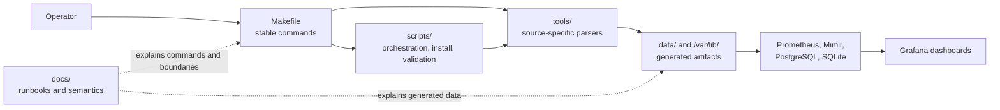
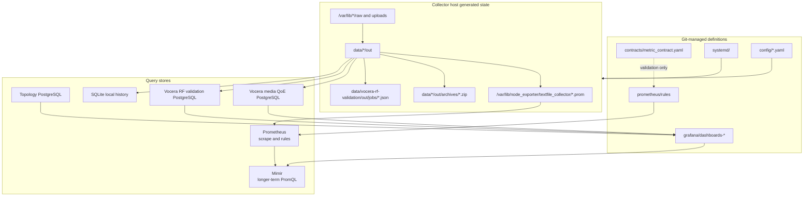
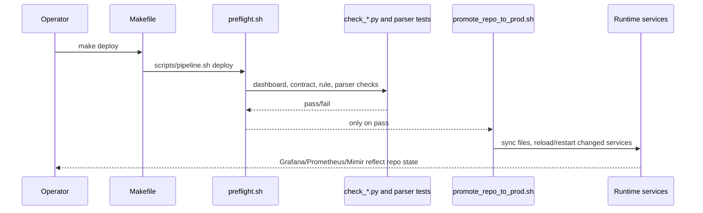
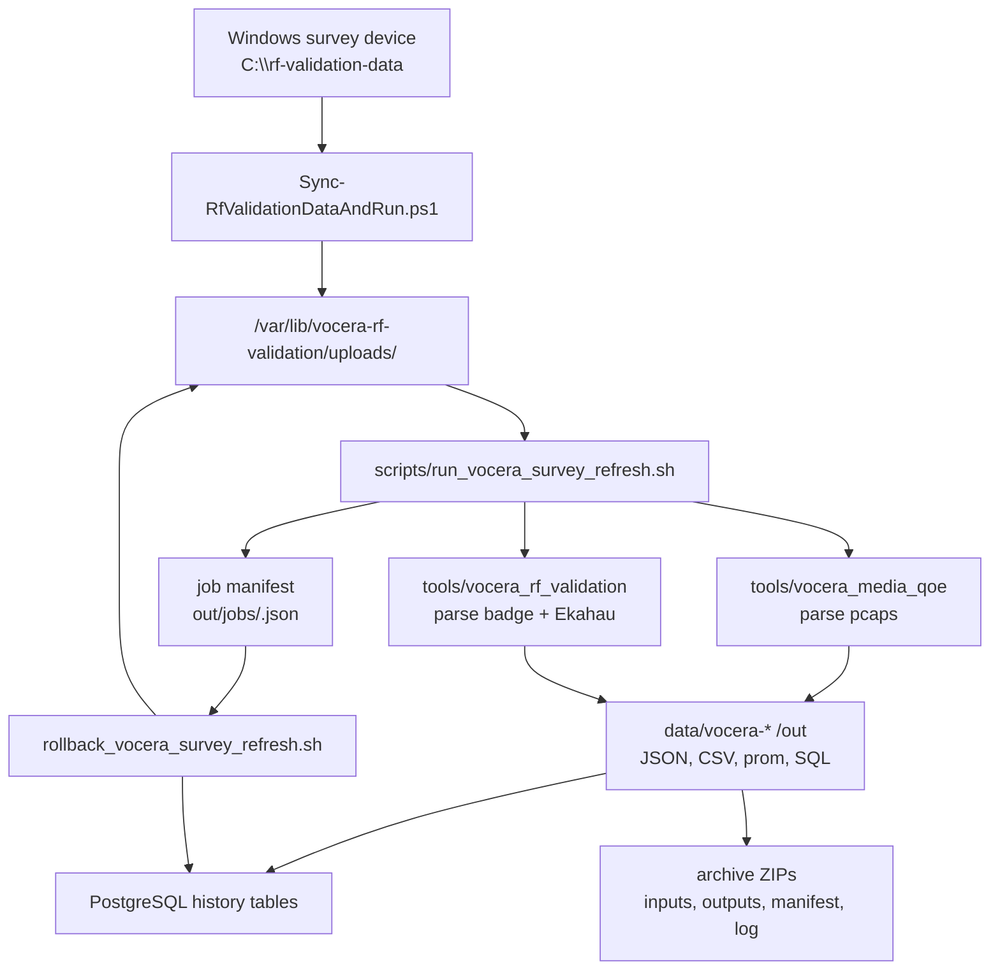

# Codebase Walkthrough

This repo is both an observability runtime definition and a set of source-
specific collectors/parsers. The fastest way to understand it is to follow the
operator entrypoints first, then the generated artifacts, then the dashboards
that consume those artifacts.

## Mental Model



`Makefile` is the public API. Scripts and Python modules are implementation
details unless a runbook explicitly tells an operator to call a script directly.

## Primary Entry Points

| Task | Start Here | Implementation | Main Outputs |
| --- | --- | --- | --- |
| Validate repo before deploy | `make validate` | `scripts/pipeline.sh`, `scripts/preflight.sh`, `scripts/check_*.py` | pass/fail diagnostics |
| Promote repo state to runtime | `make deploy` | `scripts/promote_repo_to_prod.sh` | Grafana, Prometheus, Mimir, systemd config converged from Git |
| Export DEV dashboards | `make release MSG=...` | `scripts/release.sh`, `scripts/export_dashboards.sh` | dashboard JSON under `grafana/dashboards-*` |
| Wireless RF parsing | `make wireless-rf-parse` | `tools/wireless_rf` | CSV, JSON, SQLite, Prometheus textfile |
| Badge client telemetry | `make wireless-badge-collect`, `make wireless-badge-parse` | `tools/wireless_rf` | badge JSON/CSV/SQLite/prom artifacts |
| Path probes | `make path-probe-run` | `tools/path_probe/path_probe.py` | Prometheus textfile, JSON summary |
| Vocera media ICAP QoE | `make vocera-media-qoe-publish` | `scripts/run_vocera_media_qoe_textfile.sh`, `tools/vocera_media_qoe` | latest `.prom` snapshot, per-capture cache, SQL, archive ZIP |
| Vocera badge/Ekahau validation | `make vocera-rf-validation-all` or Windows upload script | `tools/vocera_rf_validation`, `scripts/run_vocera_survey_refresh.sh` | badge JSON, Ekahau JSON, manual CSV, SQL, archive ZIP, job manifest |
| Roll back bad Vocera survey run | `make vocera-survey-rollback VOCERA_SURVEY_ROLLBACK_RUN_ID=...` | `scripts/rollback_vocera_survey_refresh.sh` | DB rows deleted, uploaded bundle moved aside |
| Network topology datasource | `make topology-publish-*`, `make topology-load-*` | `scripts/publish_dnac_topology.py`, sibling `Network-Topology` repo | PostgreSQL tables for Node Graph panels |

## Module Reference

### Control Plane Scripts

| File | Responsibility |
| --- | --- |
| `scripts/pipeline.sh` | Routes `validate`, `plan`, and `deploy` into the shared promotion path. |
| `scripts/preflight.sh` | Read-only validation gate used before release/promotion. |
| `scripts/promote_repo_to_prod.sh` | Converges the runtime host from repo state: Mimir, Prometheus, Grafana provisioning, dashboards, optional collector units. |
| `scripts/release.sh` | Exports DEV dashboards, validates, commits, and promotes. |
| `scripts/export_dashboards.sh` | Pulls dashboards from Grafana API into repo files. |
| `scripts/sync_prod_to_dev.sh` and `scripts/seed_dev_from_files.sh` | Reset editable DEV org from the repo-managed PROD baseline. |
| `scripts/status.sh` | Compares DEV, repo, and PROD dashboard state. |
| `scripts/lib/paths.sh` | Centralized repo/runtime path defaults. |
| `scripts/lib/grafana_auth.sh` | Grafana token and auth discovery. |

### Validation Scripts

| File | Checks |
| --- | --- |
| `scripts/check_dashboards.py` | Dashboard JSON structure and required metadata. |
| `scripts/check_topology_dashboard.py` | Network Topology dashboard panel/query contract. |
| `scripts/check_contract_schema.py` | Metric contract schema and rule coverage shape. |
| `scripts/check_dashboard_metric_contract.py` | Dashboard PromQL references against known metric families. |
| `scripts/check_metric_name_overlap.py` | Conflicts between raw metric names and recording-rule output names. |
| `scripts/test_*.py` | Parser and helper fixture tests run by `make test`. |

### Wireless RF Tool

| File | Responsibility |
| --- | --- |
| `tools/wireless_rf/wireless_rf/cli.py` | CLI for WLC parsing and badge client workflows. |
| `tools/wireless_rf/wireless_rf/parser.py` | Parses raw WLC CLI sections into typed AP/RF records. |
| `tools/wireless_rf/wireless_rf/stats_engine.py` | Computes RF summaries and traffic-distribution stats. |
| `tools/wireless_rf/wireless_rf/prometheus.py` | Renders WLC RF metrics for textfile ingestion. |
| `tools/wireless_rf/wireless_rf/storage.py` | SQLite persistence for RF history and deltas. |
| `tools/wireless_rf/wireless_rf/dnac_client.py` | Catalyst Center read/download API client. |
| `tools/wireless_rf/wireless_rf/client_*` | Badge client-detail collection, parsing, storage, and Prometheus rendering. |
| `tools/wireless_rf/streamlit_app.py`, `badge_client_app.py` | Optional local review UIs. |

### Vocera Media QoE Tool

| File | Responsibility |
| --- | --- |
| `tools/vocera_media_qoe/vocera_media_qoe.py` | Single-pcap analyzer and Prometheus/JSON renderer. |
| `tools/vocera_media_qoe/vocera_media_qoe_batch.py` | Scans raw pcap directories, caches per-capture outputs, publishes newest snapshot, emits SQL, archives runs. |
| `tools/vocera_media_qoe/vocera_dnac_icap.py` | Catalyst Center ICAP capture download/start helper. |
| `tools/vocera_media_qoe/vocera_media_qoe_sql.py` | Converts parsed capture JSON into PostgreSQL import SQL. |
| `tools/vocera_media_qoe/vocera_multicast.py` | Maps Vocera dynamic multicast IPs to RFC 1112 Ethernet multicast MAC evidence. |
| `tools/vocera_media_qoe/vocera_wlc_session.py` | Generates long-running manual WLC EPC capture-session packages and event marker files. |
| `tools/vocera_media_qoe/vocera_wlc_attempt.py` | Generates manual WLC broadcast-attempt packages and command sheets. |
| `tools/vocera_media_qoe/vocera_wlc_cli.py` | Parses saved WLC multicast/client CLI transcripts into structured evidence. |
| `tools/vocera_media_qoe/vocera_wlc_evidence.py` | Validates attempt artifacts, writes PCAP sidecars, emits attempt SQL, and calculates cautious verdicts. |
| `tools/vocera_media_qoe/run_archive.py` | Shared ZIP archive helper for media parser runs. |

### Vocera RF Validation Tool

| File | Responsibility |
| --- | --- |
| `tools/vocera_rf_validation/cli.py` | Subcommand dispatcher for parse, template, correlate, DB install, and SQL emit. |
| `tools/vocera_rf_validation/models.py` | Dataclasses and serialization helpers for parsed evidence and correlation rows. |
| `tools/vocera_rf_validation/badge_diag_parser.py` | Parses badge diagnostic sys/tar/zip input into roam scan events, candidates, RRM neighbors, and radio-signal samples. |
| `tools/vocera_rf_validation/ekahau_importer.py` | Reads Ekahau JSON/ESX/ZIP inputs and extracts survey timestamps, floor names, and BSSID/AP-name mappings. |
| `tools/vocera_rf_validation/correlate.py` | Matches badge scan events to Ekahau route points, builds manual CSV rows, computes calibrated deltas. |
| `tools/vocera_rf_validation/sql_export.py` | Emits run-scoped PostgreSQL import SQL. |
| `tools/vocera_rf_validation/db.py` | Installs RF validation schema/views. |
| `tools/vocera_rf_validation/stats.py` | Outlier annotations for correlated delta exports. |
| `tools/vocera_rf_validation/run_archive.py` | Shared ZIP archive helper for RF validation runs. |

### Runtime And SQL Contracts

| Path | Responsibility |
| --- | --- |
| `prometheus/prometheus.yml` | Scrape config, remote write, and rule file loading. |
| `prometheus/rules/platform/` | Platform recording and alerting rules. |
| `prometheus/rules/wireless/` | Wireless/Vocera recording rules consumed by dashboards. |
| `grafana/provisioning/datasources/` | Stable datasource UIDs used by dashboard JSON. |
| `grafana/provisioning/dashboards/prod.yaml` | Provisioned PROD dashboard loader. |
| `sql/vocera_media_qoe_*` | Media QoE PostgreSQL tables/views. |
| `sql/vocera_rf_validation_*` | RF validation PostgreSQL tables/views. |
| `topology/postgres/init/001_topology_tables.sql` | Network topology PostgreSQL schema. |
| `systemd/` | VM services/timers installed by Make targets or promotion. |

## Runtime Data Stores



Prometheus/Mimir carry low-cardinality dashboard metrics. JSON, CSV, SQLite,
PostgreSQL, and ZIP archives carry higher-cardinality investigative detail.

## Validation And Promotion Flow



`promote_repo_to_prod.sh` refuses a dirty Git tree unless explicitly overridden.
That guard matters because PROD is meant to be reproducible from the repo.

## Vocera Survey Refresh Flow



The run id is the rollback key. Rollback uses the job manifest to find the
uploaded bundle and, when `--remove-current-outputs` is used, hash-checks
current output files before deleting them.

## Parser Contracts

The parsers follow the same contract:

- read raw source data from `/var/lib/...` or `data/.../raw`;
- write normalized JSON/CSV/prom artifacts under `data/.../out`;
- keep Prometheus labels low-cardinality;
- place detailed stream/client/row identity in JSON, CSV, SQL, or SQLite;
- create ZIP archives when parser inputs could be hard to reconstruct;
- keep operational secrets and raw production data out of Git.

## Where To Make Changes

| Change Needed | Edit These First | Then Check |
| --- | --- | --- |
| Dashboard panel/query | `grafana/dashboards-dev` or Grafana DEV export path | `make test`, `scripts/check_dashboard_metric_contract.py` |
| New dashboard metric | `prometheus/rules`, `contracts/metric_contract.yaml` | `make test`, `promtool check rules` if available |
| Runtime promotion behavior | `scripts/promote_repo_to_prod.sh`, `scripts/lib/*` | `make plan`, then `make validate` |
| New parser output metric | relevant `tools/*` module, tests, contract | `make test`, inspect generated `.prom` |
| New systemd collector | `systemd/`, installer script, `scripts/preflight.sh` | `make validate`, `systemctl cat <unit>` |
| Vocera RF matching behavior | `tools/vocera_rf_validation/correlate.py`, config, tests | `python3 scripts/test_vocera_rf_validation.py` |
| Vocera media QoE parsing | `tools/vocera_media_qoe/*`, tests | `python3 scripts/test_vocera_media_qoe.py` |
| Topology graph behavior | `topology/postgres`, `scripts/publish_dnac_topology.py`, sibling `Network-Topology` repo | `make topology-load-dry-run`, `scripts/check_topology_dashboard.py` |

## Generated Files To Inspect During Debugging

| Area | File/Directory | Why It Matters |
| --- | --- | --- |
| Wireless RF | `data/wireless-rf/out/wlc_rf.prom` | exact textfile scraped by Prometheus |
| Wireless RF | `data/wireless-rf/wlc_rf.sqlite` | local history and deltas |
| Path probe | `data/path-probe/out/path_probe.prom` | synthetic RTT/loss textfile |
| Vocera media | `data/vocera-media-qoe/out/captures/*.json` | per-capture parser cache with source identity |
| Vocera media | `data/vocera-media-qoe/out/vocera_media_qoe_summary.json` | latest published capture detail |
| Vocera RF validation | `data/vocera-rf-validation/out/badge_scan_events.json` | parsed badge roam scan events |
| Vocera RF validation | `data/vocera-rf-validation/out/ekahau_survey_points.json` | parsed survey timestamps |
| Vocera RF validation | `data/vocera-rf-validation/out/manual_ekahau_observations_template.csv` | matched badge/Ekahau rows needing manual RSSI |
| Vocera RF validation | `data/vocera-rf-validation/out/jobs/*.json` | run manifest for rollback and audit |
| Any parser run | `data/*/out/archives/*.zip` | inputs, outputs, manifest, and log for a run |

## Testing Strategy

`make test` is intentionally broad and lightweight. It validates dashboard JSON,
dashboard/query contracts, metric contracts, parser fixtures, topology dashboard
shape, and source-specific parser behavior without needing the live production
services.

For targeted changes, run the smallest relevant test first:

```bash
python3 scripts/test_vocera_media_qoe.py
python3 scripts/test_vocera_rf_validation.py
PYTHONPATH=tools/wireless_rf python3 scripts/test_wireless_rf_parsers.py
python3 scripts/test_path_probe.py
```

Then run `make test` before committing or promoting.

## Common Failure Patterns

- **Grafana panel is empty:** check the dashboard query, recording rule, metric
  contract, and whether Prometheus is scraping the expected textfile.
- **Parser output is stale:** compare source file path/size/mtime in the JSON
  cache with the raw file; many parsers intentionally skip unchanged inputs.
- **Vocera badge/Ekahau template has no rows:** check measurement dates,
  timezone, and configured match window before assuming the parser failed.
- **Media QoE pcap is rejected:** check Catalyst Center sidecar `fileSize`
  against the local pcap size; partial downloads are intentionally not trusted.
- **PROD dashboard differs from repo:** use `make status`, then promote from a
  clean tree; PROD should not be hand-edited.
